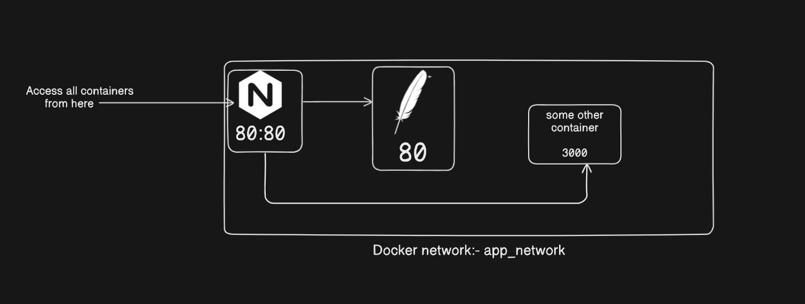

# ProxyDock

**ProxyDock** is a powerful, Docker-based solution that seamlessly manages reverse proxies with Nginx, ensuring smooth container communication and routing for your containerized applications.

---

## Working

Here are the working of ProxyDock:

*working of ProxyDock*

---

## Features

- **Dockerized Reverse Proxy**: Automatically configures reverse proxy settings using Nginx to route traffic between Docker containers.
- **Dynamic Configuration**: Adds new proxy entries to the Nginx configuration dynamically as new containers join the network.
- **Network-Aware**: Detects containers within the same Docker network and configures them with appropriate upstream and location blocks.
- **Easy Integration**: Integrates with any Dockerized application with minimal configuration.
- **Real-time Configuration Reload**: Reloads the Nginx configuration to apply updates without restarting the Nginx container.
- **Automatic Service Discovery**: Identifies new services based on container names and exposes them via the reverse proxy.
- **Scalable**: Easily scale your containerized applications without manual updates to the proxy configuration.

---

## Installation

### Prerequisites

- Docker installed and running on your system.
- Basic understanding of Nginx configuration and Docker networks.

### Step 1: Clone the Repository

Clone the **ProxyDock** repository from GitHub:

```bash
git clone https://github.com/your-username/proxydock.git
cd proxydock
```

### Step 2: Configuration

- **Nginx Configuration**: The Nginx configuration file (`nginx.conf`) is designed to work dynamically with containers in the same Docker network. It will be updated automatically as new containers are detected.

- **Docker Compose File**: A Docker Compose file is provided for easy deployment of the ProxyDock solution, including the Nginx reverse proxy and your application containers.

### Step 3: Modify the Docker Compose File

Ensure the following in the `docker-compose.yml`:

- Define the **app_network** to allow communication between containers.
- Set the proper dependencies for Nginx to wait for other services to be ready.

Example `docker-compose.yml`:

```yaml
version: '3'
services:
  nginx:
    image: nginx:latest
    ports:
      - "80:80"
    volumes:
      - ./nginx.conf:/etc/nginx/conf.d/default.conf
    networks:
      - app_network
    depends_on:
      - app1
      - app2

  app1:
    image: httpd:latest
    container_name: my-httpd1
    networks:
      - app_network

  app2:
    image: httpd:latest
    container_name: my-httpd2
    networks:
      - app_network

networks:
  app_network:
    driver: bridge
```

### Step 4: Start the Services

To start the containers and configure the reverse proxy, run the following command:

```bash
docker-compose up -d
```

This will start all services in the background, including the Nginx reverse proxy, and dynamically configure the proxy settings.

---

## Usage

### 1. **Add New Containers**

When new containers are added to the `app_network`, **ProxyDock** will automatically detect them and update the Nginx configuration. The container name and exposed port will be used to configure new `upstream` and `location` blocks in the Nginx configuration.

### 2. **Update Nginx Configuration**

When a new container is detected, **ProxyDock** will add the necessary proxy configuration to the Nginx config file. Afterward, the Nginx container will automatically reload to apply the changes without any downtime.

### 3. **Access Services**

Once the proxy is configured, you can access the services through the proxy URL:

- Service 1: `http://localhost/my-httpd1`
- Service 2: `http://localhost/my-httpd2`

Each service will be proxied to the correct container based on the configuration.

### 4. **Service Discovery**

As new containers are added, the Nginx reverse proxy will automatically detect them and make them accessible through unique URLs, making the process of adding new services seamless.

---

## Troubleshooting

- **Nginx Not Reloading Automatically**: If the Nginx configuration doesn't reload automatically after adding new containers, you can manually reload it by running:

  ```bash
  docker exec -it <nginx-container-name> nginx -s reload
  ```

- **Container Not Detected**: Ensure that the container is on the same Docker network as the Nginx container (`app_network` in the example).

- **Port Conflicts**: Make sure no two containers are trying to use the same port within the network.

---

## Contributing

1. Fork the repository.
2. Create a new branch (`git checkout -b feature-branch`).
3. Make changes and commit them (`git commit -am 'Add feature'`).
4. Push the changes to your fork (`git push origin feature-branch`).
5. Create a pull request to the main repository.

---

## License

**ProxyDock** is released under the MIT License.
